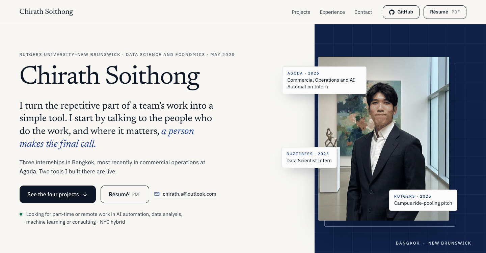

# chirath-st.github.io

Source of the personal portfolio of **Chirath Soithong**, B.S. Data Science and Economics (minor in Computer Science) at Rutgers University–New Brunswick, expected May 2028.

**Live site: https://chirath-st.github.io**



## Pages

| Path | What it is |
|---|---|
| [`/`](https://chirath-st.github.io/) | Home: four projects on one screen, experience timeline, contact |
| [`/cases/sales-checks/`](https://chirath-st.github.io/cases/sales-checks/) | Project 01 · Agoda: possible sales opportunities, flagged automatically and approved by a person |
| [`/cases/questions-desk/`](https://chirath-st.github.io/cases/questions-desk/) | Project 02 · Agoda: one place for a team's questions, each sent to the right lane |
| [`/cases/client-data/`](https://chirath-st.github.io/cases/client-data/) | Project 03 · BuzzeBees: helping an overseas AI client decide which data it could use |
| [`/cases/campus-rides/`](https://chirath-st.github.io/cases/campus-rides/) | Project 04 · Rutgers Road to Silicon Valley Pitching Competition: a campus ride-pooling pitch |
| [`/projects/morning-briefing/`](https://chirath-st.github.io/projects/morning-briefing/) | Morning news briefing: a weekday news summary, read aloud and sent to Telegram |
| [`/projects/daily-planner/`](https://chirath-st.github.io/projects/daily-planner/) | Daily planner: one Slack plan for the whole day |
| [`/projects/research-report/`](https://chirath-st.github.io/projects/research-report/) | Research report: does a bigger model predict prices better? (DeepLOB extension, submitted to the Rutgers Quant Finance Club) |
| [`/tech/`](https://chirath-st.github.io/tech/) | Technical edition: the same work for technical readers, with detail pages under `/tech/work/` |

## Tech stack

- **Vite 6**, multi-page build, vanilla JavaScript (no framework)
- **GSAP ScrollTrigger** for scroll-driven pictures, **Lenis** for smooth scrolling on the technical edition
- Plain CSS with custom-property design tokens; self-hosted fonts (Newsreader, IBM Plex Sans, JetBrains Mono)
- A small Vite plugin (`vite.config.js`) that resolves build-time HTML includes: shared partials, facts from `src/data/facts.json`, responsive `` tags with captions and photo credits from `src/data/photo-credits.json`, and Open Graph / Twitter tags for every page
- Python + Pillow (`scripts/make-og.py`) for the 1200×630 link-preview images

Every page is complete without JavaScript: the HTML holds the finished pictures, and scripts only add motion and interaction. `prefers-reduced-motion` and an on-page "Turn off animation" switch show the finished state.

## Run, build, deploy

Requires Node.js 20 or newer.

```bash
npm ci
npm run dev       # dev server at http://localhost:5173
npm run build     # production build into dist/
npm run preview   # serve dist/ locally
```

The site is built locally and published to the `gh-pages` branch, which GitHub Pages serves:

```bash
bash scripts/deploy-pages.sh   # builds, then pushes dist/ to gh-pages
```

After changing a page title or head photo, regenerate the link-preview images with `python3 scripts/make-og.py`.

## Project structure

```
index.html, 404.html     home page and not-found page
cases/<slug>/            the four project pages
projects/<slug>/         the three side-project pages
tech/                    technical edition (tech/work/<slug>/ for its detail pages)
src/biz/                 scripts for the main edition (kit/ = shared interactive pieces)
src/lib/, src/main.js    scripts for the technical edition
src/styles/              CSS (biz/ = main edition, pages/ = technical edition pages)
src/partials/            HTML partials included at build time
src/data/                facts.json and photo-credits.json
public/                  fonts, images, résumé PDFs, link-preview images
scripts/                 deploy, link-preview images, screenshot and page-check tools
```

## Credits

Photos come from Wikimedia Commons under open licences (CC BY, CC BY-SA, CC0 or public domain) and are credited on each page that uses them; the full list with sources and licences is in `src/data/photo-credits.json`. Tool logos come from [Simple Icons](https://simpleicons.org/) (CC0); the trademarks belong to their owners (see `public/img/logos/README.txt`).
